# Autism Physio-AI Pipeline — Detailed Process Flowchart

## Complete Pipeline Flow (Modules 2A, 1, 3, 4, 5)

```mermaid
flowchart TD
    %% ====================================================================
    %% STYLING
    %% ====================================================================
    classDef startEnd fill:#1a1a2e,stroke:#e94560,color:#fff,stroke-width:2px
    classDef process fill:#16213e,stroke:#0f3460,color:#fff,stroke-width:2px
    classDef subprocess fill:#533483,stroke:#0f3460,color:#fff,stroke-width:1px
    classDef decision fill:#e94560,stroke:#1a1a2e,color:#fff,stroke-width:2px
    classDef data fill:#0f3460,stroke:#533483,color:#fff,stroke-width:2px
    classDef output fill:#1b4332,stroke:#40916c,color:#fff,stroke-width:2px
    classDef moduleHead fill:#e94560,stroke:#1a1a2e,color:#fff,stroke-width:3px,font-size:16px

    %% ====================================================================
    %% PIPELINE START
    %% ====================================================================
    START(((START))):::startEnd

    START --> M2A_HEAD

    %% ====================================================================
    %% MODULE 2A — DATA SIMULATION
    %% ====================================================================
    M2A_HEAD[/"MODULE 2A — Data Simulation v1.1.0"\]:::moduleHead

    M2A_HEAD --> M2A_1[/"Input:\nDuration, N events, Emotions,\nNoise level, Seed, N users"/]:::data
    M2A_1 --> M2A_S1

    subgraph M2A ["Module 2A — Data Simulation Pipeline"]
        direction TB
        M2A_S1["Step 1: UserProfileGenerator\nGenerate participant profiles\n(physiology + demographics)"]:::process
        M2A_S1 --> M2A_O1[/"UserProfile objects\n(age, gender, severity,\nverbal_status, comorbidity,\nbaseline physiology)"/]:::output

        M2A_O1 --> M2A_S2["Step 2: EventScheduler\nPlace non-overlapping emotion\nevents on timeline"]:::process
        M2A_S2 --> M2A_O2[/"Event list\n(start_s, end_s, emotion,\nevent_id, duration)"/]:::output

        M2A_O2 --> M2A_S3["Step 3: Signal Generation\nGenerate baseline signals\n(SCL, PPG beats, ST drift,\nACC gravity)"]:::process
        M2A_S3 --> M2A_O3[/"Raw baseline signals\nEDA: 4 Hz | BVP: 64 Hz\nIBI: event | ST: 4 Hz\nACC: 32 Hz x 3 axes"/]:::output

        M2A_O3 --> M2A_S4["Step 4: Event Modulation\nApply emotion profiles to\nsignals during event windows\n(severity: Low=1.0x, Med=1.3x,\nSevere=1.6x)"]:::process
        M2A_S4 --> M2A_O4[/"Modulated signals\n(emotion-specific patterns\napplied per profile)"/]:::output

        M2A_O4 --> M2A_S5["Step 5: NoiseInjector\nAdd realistic noise\n(Hampel, Gaussian, powerline,\nmotion artefacts)"]:::process
        M2A_S5 --> M2A_O5[/"Noisy signals\n(3 tiers: low/med/high)"/]:::output

        M2A_O5 --> M2A_S6["Step 6: Clip & Validate\nClip to physiological ranges\n(EDA: 0.01-30 uS, BVP: -300-300 nT,\nIBI: 300-1500 ms, ST: 25-40 C,\nACC: -4 to 4 g)"]:::process
        M2A_S6 --> M2A_O6A[/"Validated signals"/]:::output

        M2A_O6A --> M2A_S7["Step 7: AutoAnnotator\nGenerate annotations:\nevent labels, SQI (0-1 per\n10s window), sample-level labels"]:::process
    end

    M2A_S7 --> M2A_OUT

    M2A_OUT[/"M2A Outputs:\n--- Per-signal CSVs ---\nEDA.csv, BVP.csv, IBI.csv,\nST.csv, ACC.csv\n--- Combined ---\ncombined_signals.csv (64 Hz)\n--- Annotations ---\nannotations_events.csv\nannotations_signal_quality.csv\nannotations_sample_labels.csv\n--- Metadata ---\nmetadata.json\n--- Plots ---\nsignal_*.png, combined_signals.png"/]:::output

    M2A_OUT --> M1_HEAD

    %% ====================================================================
    %% MODULE 1 — DATA ACQUISITION
    %% ====================================================================
    M1_HEAD[/"MODULE 1 — Data Acquisition v1.0.0"\]:::moduleHead

    M1_HEAD --> M1_DEC{{"Select\nAcquisition\nMode"}}:::decision

    subgraph M1 ["Module 1 — Data Acquisition Gateway"]
        direction TB

        M1_DEC --> |"Mode 2.1"| M1_IMPORT["DataImporter\nLoad existing CSVs/folders\nAuto-detect 4 folder layouts"]:::process
        M1_DEC --> |"Mode 2.2"| M1_SIM["SimulationConnector\nCall Module 2A in-process\n(via _isolated_import)"]:::process
        M1_DEC --> |"Mode 2.3"| M1_LIVE["LiveDataCollector\nFileStreamAdapter (replay CSV)\nor EmpaticaE4Adapter (BLE TCP)\n+ SessionAnnotator"]:::process
        M1_DEC --> |"Mode 2.4"| M1_DEPLOY["DeploymentIngester\nStrip labels, set\nis_annotated=False"]:::process

        M1_IMPORT --> M1_PACKET["Build PipelinePacket\n(signals, combined, metadata,\nsource_type, is_annotated,\nsession_id, user_id)"]:::subprocess
        M1_SIM --> M1_PACKET
        M1_LIVE --> M1_PACKET
        M1_DEPLOY --> M1_PACKET

        M1_PACKET --> M1_ROUTE{{"is_annotated?"}}:::decision
    end

    M1_ROUTE --> |"True\n(Training Path)"| M1_OUT_TRAIN
    M1_ROUTE --> |"False\n(Deployment Path)"| M1_OUT_DEPLOY

    M1_OUT_TRAIN[/"M1 Outputs (Training):\nPipelinePacket\n(is_annotated=True)\n--- CSVs ---\nEDA.csv ... ACC.csv\ncombined_signals.csv\n--- Metadata ---\npacket_metadata.json\nmodule2_run_summary.json"/]:::output

    M1_OUT_DEPLOY[/"M1 Outputs (Deployment):\nPipelinePacket\n(is_annotated=False)\n--> Skip to Module 9"/]:::output

    M1_OUT_DEPLOY --> M9_FUTURE(["Module 9\nDeployment & Inference\n(Planned)"]):::startEnd
    M1_OUT_TRAIN --> M3_HEAD

    %% ====================================================================
    %% MODULE 3 — DATA PREPROCESSING
    %% ====================================================================
    M3_HEAD[/"MODULE 3 — Data Preprocessing v1.0.0"\]:::moduleHead

    M3_HEAD --> M3_IN[/"Input:\nPipelinePacket | Folder path\n| Dict of DataFrames\n+ Demographics"/]:::data
    M3_IN --> M3_S1

    subgraph M3 ["Module 3 — Data Preprocessing Pipeline"]
        direction TB
        M3_S1["Step 1: SignalCleaner\nMissing >70% --> DISCARD\nMissing <70% --> linear interpolation\nOut-of-range --> NaN --> re-fill\nFlatline detection"]:::process
        M3_S1 --> M3_O1[/"CleaningReport per channel\n(n_missing, n_oor, n_flat,\nn_discarded, n_interpolated)"/]:::output

        M3_O1 --> M3_S2["Step 2: SignalFilterManager\nStage A: Hampel filter\n(impulse artefact removal)\nStage B: Butterworth zero-phase\nOR Kalman RTS smoother"]:::process

        M3_S2 --> M3_FILT[/"Filter parameters:\nEDA: LP 1.0 Hz\nBVP: BP 0.5-8.0 Hz\nIBI: ectopic removal only\nST: LP 0.1 Hz\nACC: BP 0.1-15.0 Hz"/]:::output

        M3_FILT --> M3_S3["Step 3: FeatureExtractor\n(Module 3 version)\n60s window, 50% overlap\n80 features per window"]:::process
        M3_S3 --> M3_O3[/"Per-signal feature DataFrames\n+ combined features DataFrame"/]:::output

        M3_O3 --> M3_S4["Step 4: DemographicEncoder\nOrdinal encoding:\nseverity: Low=1, Med=2, Severe=3\nverbal: Verbal=0, Min=1, Non=2\nAppend to all rows"]:::process
        M3_S4 --> M3_O4[/"Feature DFs + demographic columns"/]:::output

        M3_O4 --> M3_S5["Step 5: FeatureNormaliser\nRobustScaler\n(median + IQR)\n+ FeatureFuser\n(merge_asof window alignment)"]:::process
        M3_S5 --> M3_O5[/"Per-signal DFs (raw + norm)\nCombined DF (raw + norm)\nFitted scaler object"/]:::output

        M3_O5 --> M3_S6["Step 6: Visualiser + Exporter\nProcessed signal plots\nRaw vs processed comparison\nSNR gain annotations"]:::process
    end

    M3_S6 --> M3_OUT

    M3_OUT[/"M3 Outputs:\n--- features_raw/ ---\nEDA_features.csv (18 features)\nBVP_features.csv, IBI_features.csv\nST_features.csv, ACC_features.csv\ncombined_features.csv\n--- features_normalised/ ---\n*_features_norm.csv\ncombined_features_norm.csv\n--- Plots ---\nprocessed_*.png, comparison_*.png\n--- Reports ---\ncleaning_report.csv\npreprocessing_metadata.json"/]:::output

    M3_OUT --> M4_HEAD
    M3_OUT --> M5_HEAD_LINK

    %% ====================================================================
    %% MODULE 4 — FEATURE ENGINEERING
    %% ====================================================================
    M4_HEAD[/"MODULE 4 — Feature Engineering v1.0.0"\]:::moduleHead

    M4_HEAD --> M4_IN[/"Input:\nM3 output folder | Dict of DFs\n+ Demographics (auto-loaded\nfrom metadata.json)"/]:::data
    M4_IN --> M4_S1

    subgraph M4 ["Module 4 — Feature Engineering Pipeline"]
        direction TB
        M4_S1["Step 1: FeatureExtractor\nWindow-based extraction\n(93 features total)\nEDA=22, BVP=16, IBI=17,\nST=12, ACC=26"]:::process
        M4_S1 --> M4_O1[/"Per-signal feature DataFrames\n(one row per window)"/]:::output

        M4_O1 --> M4_S2["Step 2: Demographics Check\nValidate demographics dict\navailable from metadata"]:::process
        M4_S2 --> M4_O2[/"Demographics validated"/]:::output

        M4_O2 --> M4_S3["Step 3: FeatureNormaliser\nRobustScaler (default)\nPer-signal fit_transform\nHandle NaN/inf --> median fill"]:::process
        M4_S3 --> M4_O3[/"Normalised per-signal DFs\n+ fitted_scaler.joblib"/]:::output

        M4_O3 --> M4_S4["Step 4: FeatureFuser\nDemographicEncoder (ordinal)\n+ merge_asof alignment\n(30s tolerance)\n--> per-signal + combined DFs"]:::process
        M4_S4 --> M4_O4[/"raw_features (per-signal)\nnorm_features (per-signal)\nraw_combined, norm_combined"/]:::output

        M4_O4 --> M4_S5["Step 5: OneHotEncoder\nCategorical demographics -->\nbinary indicators\n(gender, ethnicity, severity,\nverbal_status, comorbidity)"]:::process
        M4_S5 --> M4_O5[/"encoded_features (per-signal)\nencoded_combined"/]:::output

        M4_O5 --> M4_S6["Step 6: FeatureSelector\nEnsemble ranking:\nMutual Information + Random Forest\n+ F-statistic (ANOVA) + Variance\n--> Top N features"]:::process
        M4_S6 --> M4_O6[/"feature_importance.csv\ntop_N_features.csv\ntop_N_features_encoded.csv"/]:::output

        M4_O6 --> M4_S7["Step 7: DimensionalityReducer\nPCA (95% variance retention)\nPLS-VIP (supervised, VIP >= 1.0)\nTruncated SVD\n--> Compare & recommend"]:::process
    end

    M4_S7 --> M4_OUT

    M4_OUT[/"M4 Outputs:\n--- features_raw/ ---\n*_features.csv, combined_features.csv\n--- features_normalised/ ---\n*_features_norm.csv, combined_features_norm.csv\n--- features_encoded/ ---\n*_features_encoded.csv\ncombined_features_encoded.csv\n--- features_selected/ ---\nfeature_importance.csv\ntop_N_features.csv\ntop_N_features_encoded.csv\n--- dimensionality_reduction/ ---\npca_components.csv, pca_transformed.csv\npca_explained_variance.csv\npls_vip_scores.csv, svd_transformed.csv\ncomparison_report.json\n--- Scaler ---\nfitted_scaler.joblib\n--- Metadata ---\nfeature_engineering_metadata.json"/]:::output

    M4_OUT --> M5_MODEL(["Module 5\nModel Training\n(Planned)"]):::startEnd

    %% ====================================================================
    %% MODULE 5 — DATA ANALYSER
    %% ====================================================================
    M5_HEAD_LINK["From M3 Output"]:::data
    M5_HEAD_LINK --> M5_HEAD

    M5_HEAD[/"MODULE 5 — Data Analyser v1.0.0"\]:::moduleHead

    M5_HEAD --> M5_IN[/"Input:\nM3 output folder\n(signals + features_raw/)\n| Dict of DataFrames"/]:::data
    M5_IN --> M5_S1

    subgraph M5 ["Module 5 — Data Analyser Pipeline"]
        direction TB
        M5_S1["Step 1: Data Loading\nLoad signal CSVs\n+ feature CSVs from features_raw/\n+ combined features\nFallback: reconstruct from\nfeature means"]:::process
        M5_S1 --> M5_O1[/"signals_dict\nfeatures_dict\ncombined_df"/]:::output

        M5_O1 --> M5_S2["Step 2: SignalAnalyser\nTemporal Dynamics Analysis"]:::process

        subgraph M5_S2_SUB ["SignalAnalyser Subprocesses"]
            direction TB
            M5_S2A["Extract per-event segments\nfrom annotated signals"]:::subprocess
            M5_S2A --> M5_S2B["Per event x signal:\n- Pre-event baseline (30s median/std)\n- Peak value, time-to-peak\n- % change from baseline\n- Peak alignment with event"]:::subprocess
            M5_S2B --> M5_S2C["Post-event analysis:\n- Time to subside (50% return)\n- Return to baseline check\n- Median drift"]:::subprocess
            M5_S2C --> M5_S2D["Adaptive threshold detection:\nRunning median +/- N x MAD\nFlag sustained deviations\n(> 30s default)"]:::subprocess
        end

        M5_S2 --> M5_O2[/"event_dynamics DataFrame\nmedian_drift DataFrames\nreturn_summary DataFrame\nthreshold_events DataFrame"/]:::output

        M5_O2 --> M5_S3["Step 3: Statistical Analyses"]:::process

        subgraph M5_S3_SUB ["Statistical Subprocesses"]
            direction TB
            M5_S3A["Descriptive: per-target\nmean, std, median, IQR,\nmin, max, CV"]:::subprocess
            M5_S3A --> M5_S3B["Kruskal-Wallis H-test\n(non-parametric, all targets)\nwith eta-squared effect size"]:::subprocess
            M5_S3B --> M5_S3C["Pairwise Mann-Whitney U\n(top features, all target pairs)\nBonferroni corrected"]:::subprocess
            M5_S3C --> M5_S3D["Spearman correlation\n(features vs ordinal target)"]:::subprocess
            M5_S3D --> M5_S3E["Feature-feature correlation\nmatrix (top 30 by variance)"]:::subprocess
            M5_S3E --> M5_S3F["Signal % change summary\n(mean/median/min/max per\nsignal x target)"]:::subprocess
        end

        M5_S3 --> M5_O3[/"descriptive_df\nkruskal_df\npairwise_df\ncorr_target_df\ncorr_matrix_df\npct_change_df"/]:::output

        M5_O3 --> M5_S4["Step 4: AnalysisVisualiser\nGenerate all plots"]:::process

        subgraph M5_S4_SUB ["Visualisation Subprocesses"]
            direction TB
            M5_S4A["Descriptive boxplots\n(per signal, top features)"]:::subprocess
            M5_S4A --> M5_S4B["% change from baseline\n(bar charts per signal)"]:::subprocess
            M5_S4B --> M5_S4C["Temporal dynamics\n(time-to-peak, subside, return)"]:::subprocess
            M5_S4C --> M5_S4D["Return-to-median rate\n(% events returned)"]:::subprocess
            M5_S4D --> M5_S4E["Kruskal-Wallis significant\nfeatures (p-value ranked)"]:::subprocess
            M5_S4E --> M5_S4F["Feature-target correlation\n+ Feature-feature heatmap"]:::subprocess
            M5_S4F --> M5_S4G["Adaptive threshold overlay\n(signal + running median +/- MAD)"]:::subprocess
            M5_S4G --> M5_S4H["3D time-synchronised projection\n(Plotly interactive HTML)"]:::subprocess
            M5_S4H --> M5_S4I["Median drift\n(post-event shift bars)"]:::subprocess
        end

        M5_S4 --> M5_O4[/"10+ PNG plots\n+ 3d_signals.html"/]:::output

        M5_O4 --> M5_S5["Step 5: AnalysisReporter\nGenerate HTML report\n+ CSV summary tables"]:::process
    end

    M5_S5 --> M5_OUT

    M5_OUT[/"M5 Outputs:\n--- Report ---\nanalysis_report.html\nanalysis_metadata.json\n--- Plots ---\ndescriptive_boxplot_*.png\npct_change_from_baseline.png\ntemporal_dynamics.png\nreturn_to_median_rate.png\nsignificant_features_kruskal.png\ncorrelation_feature_target.png\ncorrelation_matrix.png\nthreshold_*.png\nmedian_drift.png\n3d_signals.html + .png\n--- summary_tables/ ---\ndescriptive_statistics.csv\nkruskal_wallis_results.csv\npairwise_mannwhitney.csv\ncorrelation_feature_target.csv\ncorrelation_matrix.csv\ntemporal_dynamics.csv\nreturn_to_median_summary.csv\npct_change_summary.csv\nthreshold_events.csv"/]:::output

    M5_OUT --> ANALYSIS_END(((END\nAnalysis\nComplete))):::startEnd

    %% ====================================================================
    %% CROSS-MODULE DATA FLOW ANNOTATIONS
    %% ====================================================================

    linkStyle default stroke:#e0e0e0,stroke-width:2px
```



## Legend — Flowchart Symbols

| Symbol | Meaning |
|--------|---------|
| **Rounded rectangle** (process) | Processing step / operation |
| **Parallelogram** (data) | Input data / data store |
| **Diamond** (decision) | Decision point / routing logic |
| **Rectangle with clipped corners** (output) | Output files / artefacts |
| **Stadium / pill shape** (start/end) | Start / End / Future module |
| **Trapezoid** (module header) | Module entry point |
| **Subgraph** (container) | Module boundary / subprocess group |

## Colour Key

| Colour | Meaning |
|--------|---------|
| **Red header** | Module entry point |
| **Dark blue** | Processing step |
| **Purple** | Sub-process within a step |
| **Navy parallelogram** | Input data |
| **Green** | Output files / artefacts |
| **Red diamond** | Decision / routing point |

## Data Flow Summary

```
Module 2A ──> Module 1 ──> Module 3 ──┬──> Module 4 ──> Module 5 (Model Training) [Planned]
(Simulate)    (Acquire)    (Preprocess) |   (Feature Eng.)
                                        |
                                        └──> Module 5 (Data Analyser)
                                             (Statistical Analysis & Reporting)
```

### Output Forward Paths

| Source Module | Output | Consumed By |
|--------------|--------|-------------|
| **M2A** | Per-signal CSVs, combined_signals.csv, annotations, metadata.json | **M1** (Mode 2.2 Simulate) |
| **M1** | PipelinePacket (is_annotated=True) | **M3** (Training path) |
| **M1** | PipelinePacket (is_annotated=False) | **M9** (Deployment path, planned) |
| **M3** | features_raw/*.csv, features_normalised/*.csv, cleaned signals | **M4** (Feature Engineering) |
| **M3** | Signal CSVs + features_raw/ | **M5 Analyser** (Statistical Analysis) |
| **M4** | features_selected/top_N_features.csv | **M5 Training** (Model Training, planned) |
| **M4** | features_encoded/combined_features_encoded.csv | **M5 Training** (Early fusion model) |
| **M4** | pls_vip_scores.csv | **M5 Training** (Feature importance guidance) |
| **M4** | fitted_scaler.joblib | **M5 Training** / **M9** (Transform test/deployment data) |
| **M5 Analyser** | analysis_report.html, summary CSVs | **Researcher** (Interpretation & validation) |
